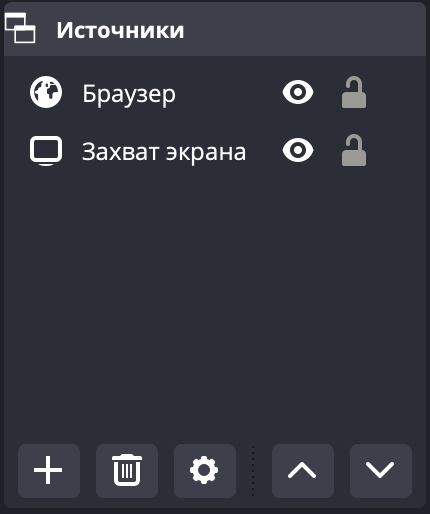
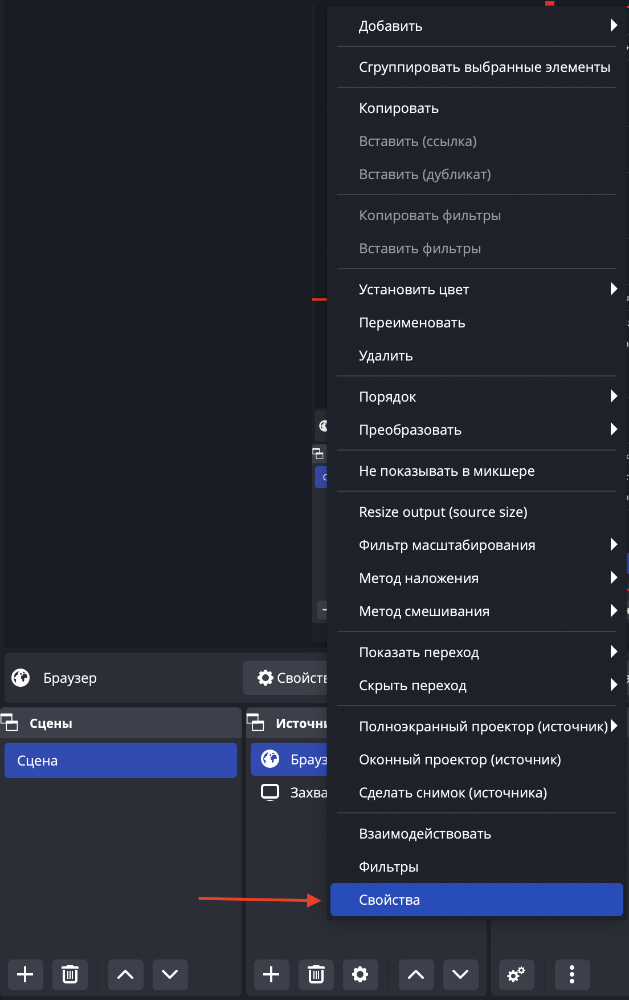

# collecting-donations — the prototype for collecting donations from the Alfa bank.


> ## Prehistory
> On November 11-13, 2022, the hackathon "Hack&Change" from `Changellenge` took place, it took place online.
> And we - 4 students from the HSE University, joined a team and went to participate in this event.
> We were developing a prototype for collecting donations from the Alfa Bank.

[](/LICENSE)


# Table of contents
- [Tools provided](#tools-provided)
- [Architectural solution](#architectural-solution)
- [Using](#using)
- - [For streamers](#for-streamers)
- - [For viewers](#for-viewers)
- [Installation and run](#installation-and-run)
- - [Installation](#Installation)
- - [Run](#run)
- [Frontend](#frontend)
- [Report](#report)
- [Demonstration of the prototype](#demonstration-of-the-prototype)
- [The License](#the-license)


# Tools provided
We used [`the netmonet service from Alfa Bank`](https://netmonet.co/) in order to send donations.
During the hackathon Alfa Bank provided us with tokens for the API service

[🔝Table of contents](#table-of-contents)


# Architectural solution


[🔝Table of contents](#table-of-contents)


# Using
## For streamers
❗The streamer must be registered on the `netmonet service`. \
❗The steps suitable for [`OBS Studio`](https://obsproject.com/).
On the other streaming platforms, the steps will be similar. \
If you want to use this tool, you should follow a few steps:
1. Open `OBS Studio` and add `Browser` into `Sources`.



2. Click `right mouse button` and open `browser features`.



3. Enter url where the plugin is located into `url-address` field. \
Instead of the `id`, you should substitute the id of the streamer that the `netmonet service` provided to you.


That's all. Now the donations will be displayed on your stream.

## For viewers
If you want to make a donation, you should follow `the link` or `QR-code` that the streamer will give you.
- Link example: [`https://netmonet.co/tip/236461?mterror=not_found_entity`](https://netmonet.co/tip/236461?mterror=not_found_entity).
- QR-code example: 


[🔝Table of contents](#table-of-contents)

# Installation and run
❗If you want to test this prototype,
then you should understand that there must be a token for the `netmonet API` for this.
(We were given it for the duration of the hackathon, perhaps it is no longer valid).

## Installation
1. We clone the repositories with the backend code and the frontend code:
```
$ git clone https://github.com/TheTeamOfCrowsFromHSE/collecting-donations.git
$ git clone https://github.com/TheTeamOfCrowsFromHSE/donations-frontend
```
2. We should install any local server, where we will start a database. \
❗We use `MAMP` server and `MySQL` database management system.
3. We should install `yarn`:
```
$ npm install --global yarn
```
4. We should pull up dependencies for the project:
```
$ npm install yarn
```
## Run
1. Build backend code with the help `Maven` and run.
2. Run frontend code:
```
$ yarn start
```
3. Follow to url [`http://localhost:3000/plugin/1`](http://localhost:3000/plugin/1). \
If everything went well, you will see the picture:


[🔝Table of contents](#table-of-contents)

# Frontend
If you want to see frontend you should follow to [`another repository`](https://github.com/TheTeamOfCrowsFromHSE/donations-frontend).

[🔝Table of contents](#table-of-contents)

# Report
If you want to see our presentation with which we performed,
you can find it in [`doc/report`](https://github.com/TheTeamOfCrowsFromHSE/collecting-donations/tree/main/doc/report).

[🔝Table of contents](#table-of-contents)

# Demonstration of the prototype
You can see how we tested our prototype on YouTube: https://www.youtube.com/watch?v=SeXzcE0J7bU

[🔝Table of contents](#table-of-contents)

# The License
`collecting-donations` is distributed under the [MIT License](https://github.com/TheTeamOfCrowsFromHSE/collecting-donations/blob/main/LICENSE), on behalf of TheTeamOfCrowsFromHSE.

[🔝Table of contents](#table-of-contents)
